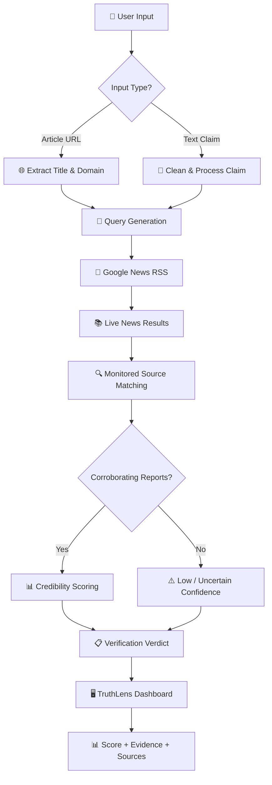
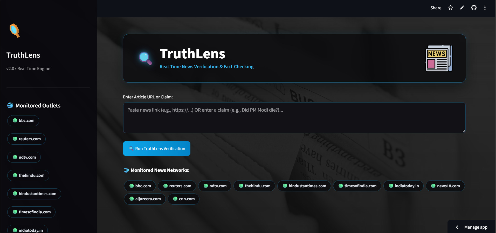
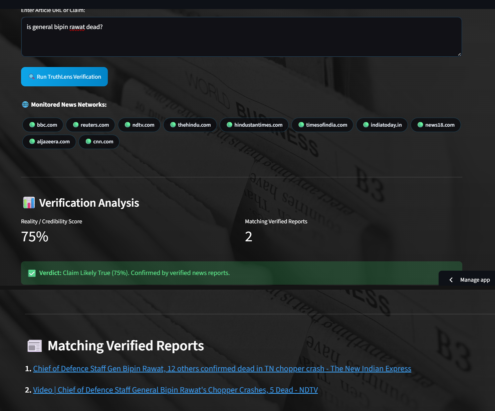

# 🔍 TruthLens — Real-Time News Verification & Fact-Checking Engine

> A real-time news credibility analysis system that cross-references claims and article links against live news feeds and monitored news sources.

TruthLens is a Streamlit-based news verification application that helps users evaluate online news claims and article URLs.

The system accepts an **article URL or text-based claim**, retrieves relevant live news results, compares them against monitored news sources, and generates a **rule-based credibility assessment** with supporting reports.

---
## 🚀 Live Demo

[](https://truthlens-news.streamlit.app/)

**Live Application:**  
[TruthLens | News Credibility Engine](https://truthlens-news.streamlit.app/)

> Enter a news claim or article URL and view its credibility score, verification verdict, and matching reports from monitored news sources.
---

## 🎯 Problem Statement

The rapid spread of misleading headlines and unverified claims makes it difficult to determine whether information circulating online is being independently reported.

TruthLens addresses this by cross-referencing claims with **live news coverage from monitored sources** instead of relying only on a single article.

---

## 💡 How TruthLens Works

1. **User Input** — Accepts an article URL or text-based claim.
2. **Input Processing** — Extracts article titles/domains or cleans the submitted claim.
3. **Live News Search** — Queries Google News RSS for relevant coverage.
4. **Source Matching** — Compares retrieved reports against monitored news networks.
5. **Evidence Analysis** — Checks for corroborating reports and relevant event keywords.
6. **Credibility Assessment** — Generates a rule-based credibility score.
7. **Result Display** — Shows the score, verdict, and matching reports.

---

## 🏗️ System Architecture



---

## 📸 Application Demo

### Main Interface

The TruthLens interface allows users to enter either a news article URL or a claim for verification.



### Verification Result

After processing the input, TruthLens displays a credibility score, verification verdict, and matching reports from monitored news sources.



---

## ✨ Key Features

- 🔗 **URL & Claim Verification** — Analyze article URLs or raw text claims.
- 🧹 **Smart Query Cleaning** — Removes unnecessary characters and predefined stop words.
- 📰 **Live News Retrieval** — Searches current Google News RSS results.
- 🌐 **Source Corroboration** — Checks coverage across monitored news networks.
- ⚠️ **Claim-Specific Matching** — Applies stricter matching for event-related claims.
- 📊 **Explainable Scoring** — Uses predefined rules instead of a black-box prediction.
- 🖥️ **Interactive Dashboard** — Displays credibility scores, verdicts, and supporting reports.
- 🎨 **Custom UI** — Newspaper-inspired interface built with Streamlit and custom CSS.

---

## 🧠 Verification Logic

### Article URL

```text
Article URL
    ↓
Extract Title + Domain
    ↓
Clean Search Query
    ↓
Search Live News
    ↓
Match Monitored Sources
    ↓
Calculate Score
    ↓
Generate Verdict
```

### Text Claim

```text
Text Claim
    ↓
Clean Query
    ↓
Detect Sensitive Actions
    ↓
Search Live News
    ↓
Match Relevant Reports
    ↓
Calculate Score
    ↓
Generate Verdict
```

The current implementation uses predefined rules and source corroboration rather than a trained machine-learning classification model.

---

## 📊 Scoring Model

TruthLens uses a **rule-based credibility assessment**.

| Evidence Pattern | Assessment |
|---|---|
| Multiple monitored reports corroborate the information | High confidence |
| Some monitored coverage is available | Moderate confidence |
| Limited or no corroborating coverage | Low / uncertain confidence |
| Sensitive claim lacks matching reports | Low confidence |

> **Note:** The credibility score represents the level of available supporting evidence. It is not an absolute determination that a claim is true or false.

---

## 🛠️ Technology Stack

| Category | Technologies |
|---|---|
| Language | Python |
| Frontend / UI | Streamlit |
| Web Requests | Requests |
| Web Parsing | BeautifulSoup4 |
| RSS Processing | Feedparser |
| News Retrieval | Google News RSS |
| Text Processing | Python Regex |
| UI Styling | HTML / CSS |

---

## 🔄 End-to-End Workflow

```text
User
 ↓
Article URL / Text Claim
 ↓
Input Processing
 ↓
Query Generation
 ↓
Live Google News RSS
 ↓
News Retrieval
 ↓
Source Matching
 ↓
Rule-Based Analysis
 ↓
Credibility Score
 ↓
Verification Verdict
 ↓
Supporting Reports
```

---

## 📁 Project Structure

```text
truthlens-app/
│
├── app.py
├── requirements.txt
├── README.md
└── screenshots/
    ├── main-interface.png
    └── verification-result.png
```

---

## 🔬 Technical Highlights

- Real-time RSS-based news retrieval
- URL parsing and article-title extraction
- Automated search-query cleaning
- Trusted-source corroboration
- Event-specific keyword matching
- Explainable rule-based scoring
- Interactive Streamlit dashboard
- Custom HTML/CSS interface

---

## 🚧 Limitations

TruthLens is currently a **news-source corroboration system** rather than a complete automated fact-checking model.

The reliability of its assessment can be affected by:

- 📰 Availability and freshness of live RSS results
- 🔎 Search-result quality and relevance
- ⏱️ Delays between an event occurring and news outlets reporting it
- 📝 Differences in wording between articles covering the same event
- 🌐 Coverage limitations of monitored news sources
- 📋 The predefined source and keyword matching rules

> **Note:** The credibility score represents the level of available supporting evidence. It should not be interpreted as an absolute determination that a claim is true or false.

---

## 🔮 Future Improvements

The current system provides a foundation that can be extended with more advanced AI and NLP capabilities.

- 🤖 **Semantic Similarity** — Compare claims and articles based on meaning rather than exact keywords.
- 🧠 **NLP-Based Verification** — Use transformer-based models for deeper claim analysis.
- 📰 **News Clustering** — Group multiple reports covering the same event.
- 🌍 **Multilingual Verification** — Support claims and news sources in multiple languages.
- 🔗 **Evidence Graphs** — Connect claims with supporting and contradicting reports.
- 🧩 **Named Entity Recognition** — Identify people, organizations, locations, and events.
- 📈 **Historical Analytics** — Track news coverage and credibility patterns over time.
- 🧪 **Model Evaluation** — Evaluate future ML-based verification models using labeled fact-checking datasets.

---

## 📝 Conclusion

TruthLens demonstrates how **real-time web data, news-source corroboration, and explainable rule-based analysis** can be combined to build a practical news verification system.

Instead of relying on a single article, the system searches for supporting coverage across multiple monitored news sources and presents the available evidence alongside its credibility assessment.

The current implementation provides a foundation for extending the system toward **NLP, semantic analysis, and machine-learning-based fact verification**.

---

## 👩‍💻 Author

**Harshima Joshi**

B.Tech — VLSI / Electronics

Interested in **AI, Data Science, VLSI, and intelligent information systems.**

---

## ⭐ Project

If you find TruthLens interesting, consider giving the repository a ⭐ on GitHub.
If you find TruthLens interesting, consider giving the repository a ⭐ on GitHub.
